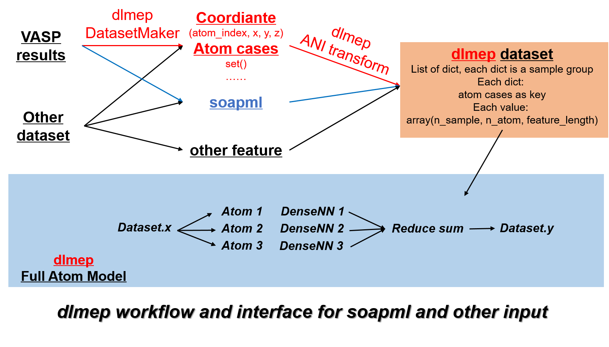
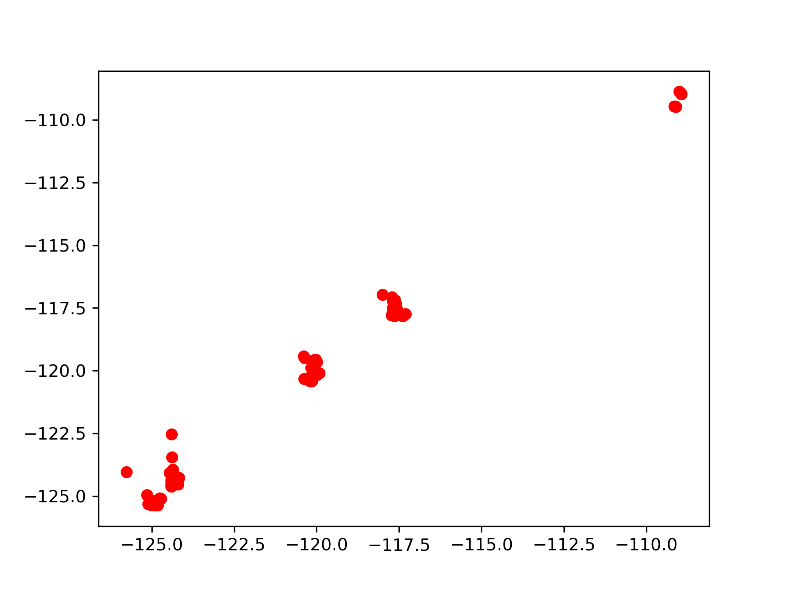
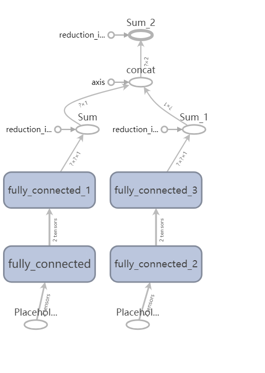

# Initial page

## Please Read this page on gitbook: [https://wangbch.gitbook.io/dlmep/](https://wangbch.gitbook.io/dlmep/)

## DeepLearningMoleculeEnergyPredict - dlmep

### introduction

dlmep is based on DeepChem. It is a neural network model for _**atom-dependent regression**_ in physics and chemistry fields. It is an _**atom number and atom type transferable**_ NN that you can predict any system as long as the atom type keeps same as train set or its subset.

**Regardless of the rationality in chemistry or physics, a transferable model should satisfy following rules:**

1. Can predict any system that atom type is a subset of atom type in train set  \(e.g. When use CH CHO CHON as train set, can predict CN, CO, CH, ...\)
2. Can predict any system with different atom number. \(e.g. When use C2H2 as train set, can predict C60H60 \)

**Here our model's transferability is achieved in two stages:**

1. When do encoding from atom structure to feature vector, the shape of feature vector can not change with the total number of atoms and type. \(e.g., the shape of feature vector of carbon in CH4 should be same as C60. In C60, H is an absent atom, leaving zero vector but feature vector do not change\)
2. When use model to train or predict, make an output that its shape is not dependent on input.

**To achieve these two stages, we have following methods:**

1. For transferability in encoding stage, use ANI-transform \(from DeepChem\) or SOAP \(from SOAPLite\) method. ANI uses a symmetry function to encode, details is in [https://arxiv.org/abs/1610.08935](https://arxiv.org/abs/1610.08935), SOAP is another encoding method but haven't tested in NN model in the paper, about SOAP: [https://arxiv.org/abs/1209.3140](https://arxiv.org/abs/1209.3140).
2. For transferability in train/test/predict stage, use a _**reduce\_sum operation**_ in tensorflow.

——————————————

### **Function**

dlmep developed the coordinate encoding method using ANI from DeepChem, and made an interface for VASP results dir as input. And dlmep supports input directly from coordinates and atom cases. Also, dlmep can use the feature encoded from soapml. _**And some part of soapml will one day be merged into dlmep.**_



Give the dir of your VASP result dirs, the program will transfer them to dataset automatically, then use ANI transform from DeepChem to get features.

The freatures will go into a Dense NN to predict energy, during the train and test process, the features are feed into different NN according to their atom index, and finally reduce\_sum to get total energy.

When you predict other datasets, **No Limitation to Atom Numbers**\(since the final layer is reduce\_sum\),but **the Atom Cases Must Included in the Trainset**. E.g., if your trainset use C2H4O1Cu20, you can predict CHO, C1Cu20, O1Cu20, ..., but you can predict CHNCu. \(But **Make Sure the Distribution of Your Trainset is Large Enough for Prediction**\).

——————————————

### **Install**

* install My Version of DeepChem, no RDKit need, worked well on Windows @ [https://github.com/B-C-WANG/deepchem](https://github.com/B-C-WANG/deepchem). Run setup.py install or just copy to site-packages \(it works for me to run it on HPC\)
* install my Vasp data extract tool VDE @ [https://github.com/B-C-WANG/VDE-VaspDataExtract](https://github.com/B-C-WANG/VDE-VaspDataExtract)

### Demo

```python
# give a dir that contains vasp result dirs, like "S:\dataset\carbonNanotobe"
aim_vasp_path = vasp_dir_path  
# print_file will write info into file named "log"
print_file(">>>>>>>>>>>>>>>>>>>>>>>>>>>>>>>New Game Begin!<<<<<<<<<<<<<<<<<<<<<<<<<<<<<<<<<<")
print_file("Start Data Collecting")

dataset_maker = DatasetMaker(aim_vasp_path)
dataset_maker.make_dataset()
total_info = dataset_maker.give_out_dataset()
print_file("Finished Data Collecting, Start Feature Transform")
   
# encode
dataset_offer = DatasetOffer(total_data_info=total_info)
    total_train_feed_x, \
    total_test_feed_x, \
    total_train_feed_y, \
    total_test_feed_y, \
    atom_cases, \
    n_feat = \
        dataset_offer.ANI_transform(save_pkl_path="ANI_features.pkl")
# this will save dataset into ANI_features.pkl

with open(ANI_pkl_file_path, "rb") as f:
      
    total_train_feed_x, total_test_feed_x, total_train_feed_y, total_test_feed_y, atom_cases, n_feat \
            = pickle.load(f)
# create model from dlmep.FullAtomModel
nn = FullAtomModel(atom_cases, os.getcwd() + "/model", n_feat)
try:
        nn.load_atom_weights()
except:
        print_file("Load Weights Failed")

index = 0
# here can use while True rather than epoch, since will save weights
# of every step
index = 0
for i in range(epoch): 
            print_file(">>Loop %s" % (index))
            for dataset_index in range(len(total_train_feed_x)):
                print_file(">>>>Train for %s/%s" % (dataset_index + 1, len(total_train_feed_x)))
                # fit data
                nn.fit(total_train_feed_x[dataset_index], total_train_feed_y[dataset_index], epoch=1000,
                       load_weights=True)
            index += 1
# and finally test
with open(ANI_pkl_file_path, "rb") as f:
        _, total_test_feed_x, _, total_test_feed_y, atom_cases, n_feat \
            = pickle.load(f)

# create model and load weights
nn = FullAtomModel(atom_cases, os.getcwd() + "/model/trained", n_feat)
nn.load_atom_weights()

pred_result = []
true_result = []
for dataset_index in range(len(total_test_feed_x)):
        pred_result.extend(nn.predict(total_test_feed_x[dataset_index]))
        true_result.extend(total_test_feed_y[dataset_index])

plt.plot(pred_result, true_result, 'ro')
plt.savefig("test_result.png", dpi=300)
plt.show()
```

_**Results: the pred\_y and true\_y plot. Predicted on testset.**_



_**Network structure of the FullAtomModel in Demo**_



## Old content

### 算法

- 给定输入坐标

- 使用DeepChem的ANITransform得到feature，将feature转化为每个原子为中心的feature，feature的向量长度就是之后NN的输入shape的最后一维

- 然后将feature按照原子归类，转为字典，key是原子序数，value是\(None, n\_feature\)大小的矩阵，每个样本都这样进行转化

- 网络的input是一个字典，key是原子序数，value是tf.placeHolder，这样可以实现对于不同种类原子使用不同的NN，然后将输入\(None, n\_feature\)经过Dense得到\(None, 1\),reduce\_sum得到1，即这种原子的能量分量，同样得到其他原子的分量，进行第二次reduce\_sum，得到总能量  


### 代码

- 获取某个文件夹下所有带OUTCAR文件的作为目标文件夹，以路径作为Key

- 使用我的VDE模块提取出每一步的能量和相应的坐标

- 这里把一个Vasp文件夹称作样本，里面每一步的能量和坐标称为帧

- 每一帧都通过ANI进行转化，得到每一帧按照原子分类的转化后的Feature

- 将Feature输入NN中进行训练，得到权重存储- 进行预测的样本也需要进行ANI转化，NN读取权重进行预测


